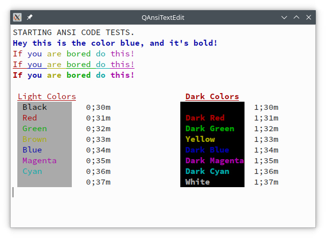

QAnsiTextEdit
=============

QAnsiTextEdit is a widget to display text that uses ANSI codes to colorize
the text's foreground and background colors. Text underlining and bolding is
also supported.

QAnsiTextEdit is an extention to Qt's QPlainTextEdit widget. It add these
api's that support ANSI codes.
```
void QAnsiTextEdit::setAnsiText (const QString& text);
void QAnsiTextEdit::appendAnsiText (const QString& text);
void QAnsiTextEdit::insertAnsiText (const QString& text);
```

It should be assumed to use QAnsiTextEdit in readonly mode. Also, using
your own ```QTextCursor``` will likely not behave well.

To use QAnsiTextEdit, copy the QAnsiTextEdit.h and QAnsiTextEdit.cpp files
to your project.

ScreenShot
==========

Running the test program will show a window with text printed using
ANSI codes.



Look at ```main.cpp``` to see how the text is sent to ```QAnsiTextEdit``` and to
the console.

The test program uses ```ANSI-color-codes.h``` from

https://gist.github.com/RabaDabaDoba/145049536f815903c79944599c6f952a

to easily print text with ANSI codes.


Building QAnsiTextEdit demo
===========================

Download the latest code using 'clone'.

    % git clone https://github.com/epasveer/QAnsiTextEdit

Setup cmake and build

    % cd QAnsiTextEdit/src
    % cd build
    % cmake ..

    % make

Install it (or not), which will usually copy it to /usr/local/bin.
May need root access.

    % cd QAnsiTextEdit/src/build
    % sudo make install

LICENSE
=======

QAnsiTextEdit source code is licensed under the MIT License.


